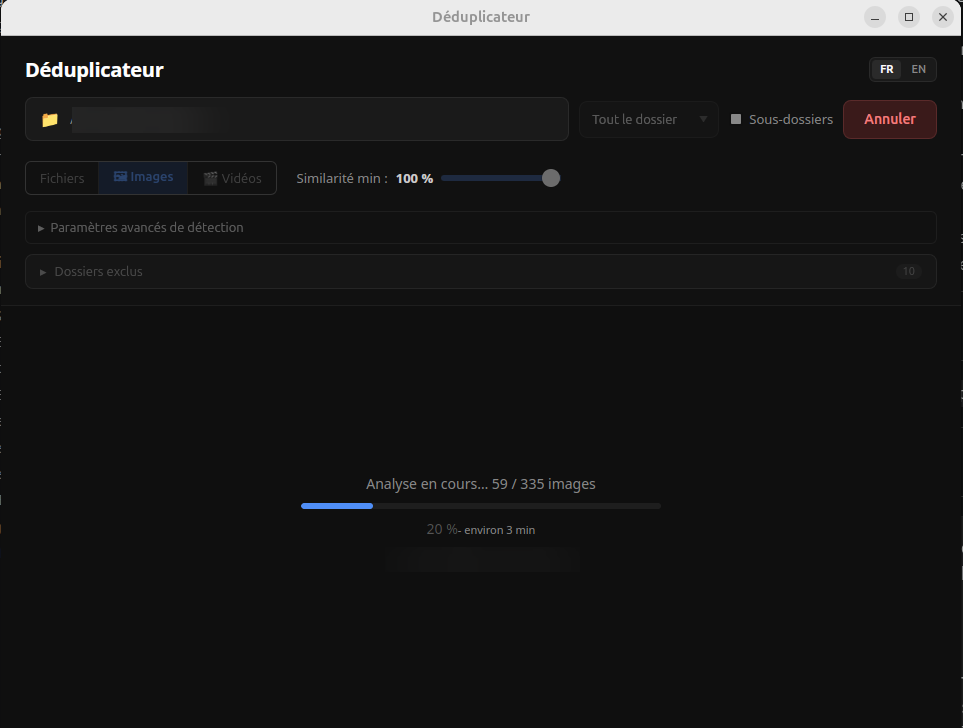
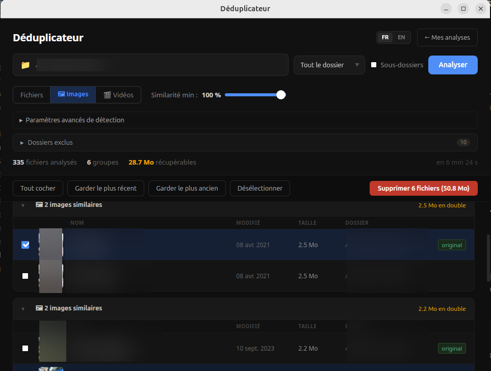

# Déduplicateur


Outil de détection et suppression de fichiers en double - rapide, local, sans cloud.


---

## Fonctionnalités

- **Détection exacte** - filtrage en cascade taille → hash xxhash3, parallélisé sur tous les cœurs, cache inter-scans pour accélérer les rescans
- **Similarité images, vidéos et audio** - même contenu en formats / résolutions / qualités différents (gradient hash, ffmpeg, fpcalc / chromaprint), seuils configurables
- **Scan d'archives** - ZIP, tar.*, 7z : compare le contenu entre archives, en exact ou similaire (images / audio)
- **Comparateurs côte à côte** - images (slider de superposition), vidéos (lecture synchronisée) et audio (lecteurs synchronisés), avec métadonnées et bouton "Garder celui-ci"
- **Modes de scan** - dossier complet, par sous-dossier indépendant, ou comparaison entre deux dossiers
- **Sessions persistantes** - chaque scan est sauvegardé et reprend après redémarrage sans rescanner
- **Sélection assistée** - règles automatiques (plus haute résolution, plus récent, dossier prioritaire...), liste d'ignorés persistante, raccourcis clavier
- **Suppression sûre** - vers la corbeille, récupérable
- **Filtres** - extensions, taille, date de modification ; filtre texte sur les résultats
- **Export** - CSV ou rapport HTML autonome
- **Profils de scan** - configurations sauvegardées, lancement en un clic
- **Notifications système** - en fin de scan long
- **Aide intégrée** - 38 articles bilingues FR / EN (touche F1)
- **Interface** - thème sombre / clair, glisser-déposer, FR / EN

---

## Captures d'écran

**Analyse en cours** - barre de progression temps réel avec estimation :



**Résultats images similaires** - groupes avec miniatures, taille récupérable, sélection en un clic :



---

## Pipeline de déduplication

```
Collecte des fichiers
        │
        ▼
Groupement par taille   ← élimine ~98 % des candidats à coût zéro
        │
        ▼
Hash partiel (4 Ko)     ← élimine les faux positifs de taille
        │
        ▼
Hash complet xxhash3    ← confirmation finale, parallèle (Rayon)
        │
        ▼
pHash images (optionnel)    ← gradient hash, cache inter-scans
        │
        ▼
Hash vidéos (optionnel)     ← N frames ffmpeg, DTW optionnel
        │
        ▼
Empreinte audio (optionnel) ← fpcalc / chromaprint, cache inter-scans
        │
        ▼
Groupes triés par espace gaspillé
```

---

## Stack technique

| Couche | Technologie |
|--------|-------------|
| Backend | Rust + Tauri 2 |
| Hachage | xxhash3 |
| Parallélisme | Rayon |
| Corbeille | trash |
| Similarité images | image_hasher |
| Similarité vidéos | ffmpeg / ffprobe (subprocess) |
| Similarité audio | fpcalc / chromaprint (subprocess) |
| Frontend | React 18 + TypeScript |
| Bundler | Vite + Tauri CLI |
| CI / CD | GitHub Actions |

---

## Téléchargement

Les binaires sont produits automatiquement par le CI à chaque tag. Aller dans l'onglet **Releases** du dépôt GitHub.

Deux variantes :

| Variante | Contenu | Quand l'utiliser |
|----------|---------|------------------|
| **light** | aucun binaire bundlé | fpcalc et ffmpeg déjà installés sur votre système |
| **full** | fpcalc + ffmpeg + ffprobe bundlés | Tout-en-un, aucune dépendance système |

| Système | Fichier (light) | Fichier (full) |
|---------|-----------------|----------------|
| Windows | `deduplicateur_x.x.x_x64-setup.exe` | `deduplicateur-full_x.x.x_x64-setup.exe` |
| Windows | `deduplicateur_x.x.x_x64_en-US.msi` | `deduplicateur-full_x.x.x_x64_en-US.msi` |
| Linux | `deduplicateur_x.x.x_amd64.AppImage` | `deduplicateur-full_x.x.x_amd64.AppImage` |
| Linux | `deduplicateur_x.x.x_amd64.deb` | `deduplicateur-full_x.x.x_amd64.deb` |
| macOS | `deduplicateur_x.x.x_x64.dmg` | non disponible (utiliser Homebrew) |

> **Windows** : au premier lancement, SmartScreen peut afficher un avertissement. Cliquer sur « Plus d'informations » puis « Exécuter quand même ».

> **macOS** : l'app n'étant pas signée par un Developer ID Apple, Gatekeeper affiche au premier lancement « Deduplicateur est endommagé et ne peut pas être ouvert » (le message est trompeur, l'app n'est pas corrompue). Glisser l'app dans `/Applications` depuis le `.dmg`, éjecter l'image disque, puis lancer une seule fois dans Terminal :
> ```bash
> xattr -cr /Applications/Deduplicateur.app
> ```
> L'app se lance ensuite normalement par double-clic. À refaire à chaque nouvelle version téléchargée.

> **Variante light** : ffmpeg et / ou fpcalc doivent être dans le `PATH` système. Voir [docs/ffmpeg.md](docs/ffmpeg.md) et [docs/fpcalc.md](docs/fpcalc.md).

---

## Compilation depuis les sources

**Prérequis :**
- [Rust](https://rustup.rs) (toolchain MSVC sur Windows)
- Node.js 22+ et npm
- Linux : `sudo apt-get install -y libwebkit2gtk-4.1-dev libgtk-3-dev librsvg2-dev patchelf`
- Windows : Visual Studio Build Tools (« Développement Desktop en C++ »), WebView2

**Développement :**
```bash
npm install
npm run tauri dev
```

**Build :**
```bash
# Variante light
bash scripts/download-fpcalc.sh
npm run build:light

# Variante full
bash scripts/download-fpcalc.sh
bash scripts/download-ffmpeg.sh
npm run build:full
```

**Tests :**
```bash
cargo test --manifest-path src-tauri/Cargo.toml
npm test
```

---

## Contribution

Voir [AGENTS.md](AGENTS.md) pour les règles de développement, les pièges connus et la checklist de clôture de tâche. L'avancement détaillé est dans [docs/plan.md](docs/plan.md).

---

## Licence

MIT - voir [LICENSE](LICENSE). Copyright (c) 2024 YavaDeus.
